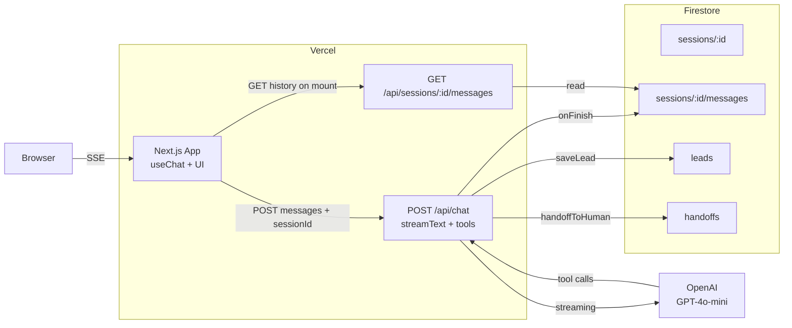

# CallBot — Asistente virtual con IA agéntica

> **Demo en vivo:** https://web-chat-bot-one.vercel.app/
>
> Prueba técnica Senior Full Stack AI Developer — CallBotIA.

Un chatbot conversacional con capacidades agénticas (tool calling + derivación a humano) para CallBotIA, una empresa de soluciones de IA conversacional. Streaming en tiempo real, persistencia de historial y captación de leads.

---

## Stack

| Capa | Tecnología | Notas |
|------|------------|-------|
| Framework | Next.js 16 (App Router) | Turbopack, React 19, route handlers como backend |
| Lenguaje | TypeScript | `strict` + `noUncheckedIndexedAccess` |
| UI | Tailwind CSS v4 + shadcn/ui | Preset `radix-nova`, base `neutral`, fuente Inter |
| Markdown | `react-markdown` + `remark-gfm` | Negritas, listas, código, links en respuestas |
| IA | Vercel AI SDK v6 (`ai`, `@ai-sdk/openai`, `@ai-sdk/react`) | Streaming SSE + tool calling oficial |
| LLM | OpenAI GPT-4o-mini | Buena relación calidad/costo para tool calling |
| Validación | Zod v4 | Inputs de tools y bodies de la API |
| Persistencia | Firebase Firestore (Admin SDK) | Sesiones, mensajes, leads y handoffs |
| Notificaciones | Sonner | Toasts de error en cliente |
| Deploy | Vercel | Frontend + API en el mismo deploy |

---

## Arquitectura



**Flujo:**
1. El cliente lee/crea un `sessionId` en `localStorage` y lo manda en cada `POST /api/chat`.
2. El endpoint usa `streamText` del Vercel AI SDK para hablar con OpenAI y stremea la respuesta como SSE.
3. Cuando el modelo decide llamar a una tool (`getCompanyInfo`, `saveLead`, `handoffToHuman`), el SDK la ejecuta server-side y le pasa el resultado al modelo, que puede seguir razonando (multi-step, hasta 5 pasos).
4. En el `onFinish`, el endpoint persiste toda la conversación en Firestore. Las tools de negocio (`saveLead`, `handoffToHuman`) además escriben en sus colecciones dedicadas, listas para alimentar un CRM o un dashboard de soporte.

---

## Decisiones arquitectónicas

### Por qué OpenAI (Opción B) y no Ollama
Vercel es serverless: un modelo local con Ollama requiere un proceso persistente con el modelo cargado en RAM. Hostearlo aparte (Fly.io, Railway con GPU) suma complejidad de infra que no aporta para el alcance de la prueba. GPT-4o-mini tiene mejor tool calling que los modelos pequeños open source y cuesta centavos para toda la demo.

### Por qué `sessionId` en `localStorage` y no Firebase Auth
El brief no pide autenticación. Un UUID por navegador da persistencia real (refrescar conserva el chat, cerrar el browser y volver mañana también) sin pedirle login al usuario, que en un asistente conversacional es fricción innecesaria. El modelo de datos reserva un campo `userId: null` en cada `SessionDoc` para que, cuando se sume Auth en v2, se pueda vincular sesiones anónimas a cuentas reales sin reescribir mensajes.

### Por qué todas las escrituras pasan por Admin SDK
El Firestore Client SDK también permite escribir desde el browser, pero hacerlo expondría la DB a manipulación. Centralizando en route handlers se valida con Zod en el servidor, se logean las invocaciones de tools y las reglas de Firestore quedan en `deny-all` (postura segura por defecto).

### Por qué `saveLead`/`handoffToHuman` persisten fuera de la conversación
Un lead capturado tiene que ser consultable por ventas; un handoff, por soporte. Si vivieran solo dentro de `sessions/:id/messages/`, encontrarlos requeriría una collection group query costosa filtrando por tipo de tool. Las colecciones planas `/leads` y `/handoffs` separan la **vista de auditoría** (transcripción completa) de la **vista de negocio** (acciones consultables).

---

## Capacidades agénticas

El bot no es un chat estático: usa **tool calling con multi-step reasoning** (`stopWhen: stepCountIs(5)`) para encadenar acciones cuando hace falta.

### Tools implementadas

| Tool | Qué hace | Persiste en |
|------|----------|-------------|
| `getCompanyInfo` | Devuelve datos oficiales de CallBotIA (servicios, planes, contacto, FAQ) desde `data/company-info.json`. | Solo en el transcript |
| `saveLead` | Captura nombre + email + interés cuando el usuario quiere contratar. | `/leads` |
| `handoffToHuman` | Simula derivación a un agente humano con motivo y nivel de urgencia. | `/handoffs` |

### Anti-alucinación

El system prompt instruye explícitamente a:
- Consultar `getCompanyInfo` antes de responder cualquier hecho sobre la empresa, en lugar de inventar.
- Decir "no tengo esa información" y derivar (`handoffToHuman`) cuando la pregunta escapa al alcance.
- Pedir los datos faltantes en lenguaje natural antes de invocar una tool incompleta.

Verificable con el prompt: *"¿Dónde está la oficina de CallBotIA en Tokio?"* → el bot reconoce que no sabe y deriva, en lugar de inventar una dirección.

---

## Variables de entorno

| Variable | Para qué | Requerida |
|----------|----------|-----------|
| `OPENAI_API_KEY` | Cliente OpenAI del Vercel AI SDK | Sí |
| `FIREBASE_PROJECT_ID` | Firebase Admin SDK | Sí |
| `FIREBASE_CLIENT_EMAIL` | Firebase Admin SDK (service account) | Sí |
| `FIREBASE_PRIVATE_KEY` | Firebase Admin SDK (service account, con `\n` escapados) | Sí |

Plantilla completa en [`.env.example`](./.env.example).

---

## Cómo correrlo local

```bash
# 1. Instalar dependencias
npm install

# 2. Copiar plantilla y completar valores reales
cp .env.example .env.local
# (editar .env.local con tus credenciales)

# 3. Levantar dev server
npm run dev
```

Abrir http://localhost:3000.

Build de producción local: `npm run build && npm run start`.

---

## Demo prompts (para evaluación)

Cada prompt ejercita una capacidad distinta:

- `¿Qué servicios ofrece CallBotIA?` → invoca `getCompanyInfo` (topic=services)
- `¿Cuánto cuesta el plan Business?` → invoca `getCompanyInfo` (topic=pricing)
- `Me interesa contratar, soy Pablo, pablo@test.com, quiero el plan Business` → invoca `saveLead`, guarda doc en `/leads`
- `Quiero hablar con una persona` → invoca `handoffToHuman`, guarda doc en `/handoffs`
- `Cuáles son los planes y después agendame, soy Ana ana@test.com` → multi-step: `getCompanyInfo` + `saveLead` en un solo turno
- `¿Dónde está la oficina de CallBotIA en Tokio?` → verifica el guardrail anti-alucinación

Cada invocación se ve en la UI como un chip ("Consultando información de CallBotIA", "Registrando tu interés", "Derivando con un agente humano"), no como caja negra.

---

## Cumplimiento de requisitos del brief

| Requisito | Estado |
|-----------|--------|
| Next.js App Router + TS + Tailwind + shadcn/ui | ✅ |
| Chat en tiempo real | ✅ streaming SSE |
| Diseño responsive | ✅ Tailwind mobile-first |
| Historial de conversación | ✅ Firestore |
| Estados de loading | ✅ typing indicator + disabled input |
| UX/UI moderna | ✅ shadcn radix-nova, Inter, markdown en respuestas |
| Backend con IA + streaming responses | ✅ Opción B (OpenAI) |
| Ingeniería agéntica obligatoria | ✅ tool calling + handoff + multi-step |
| Integración externa | ✅ OpenAI |
| Deploy Vercel | ✅ |
| README técnico + arquitectura + env vars | ✅ |
| **Bonus:** Firebase | ✅ |
| **Bonus:** Realtime streaming | ✅ |
| **Bonus:** Logs estructurados | ✅ JSON line por tool y por persist |

---

## TL;DR

- Chatbot Next.js + OpenAI con streaming, tool calling y handoff simulado.
- Persiste sesiones, mensajes, leads y handoffs en Firestore (sessionId en localStorage, sin Auth).
- 3 tools con guardrails contra alucinación, multi-step reasoning hasta 5 pasos.
- Deployado en Vercel. Listo para probar con los prompts de la sección anterior.
